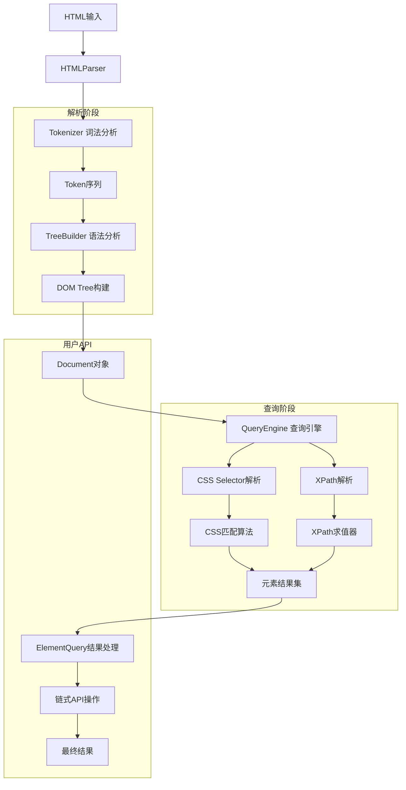
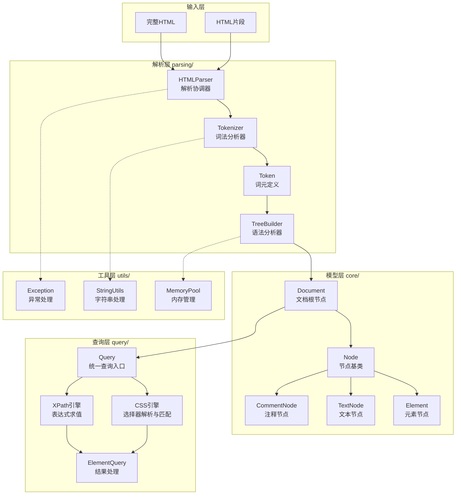
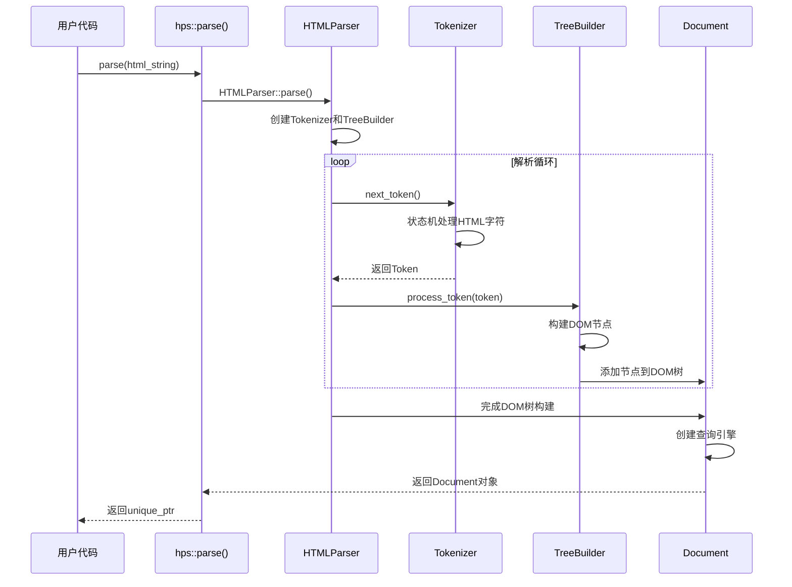

## 1. 核心特性

### 1.1 解析能力

- **完整 HTML 解析**：遵循 HTML5 标准解析流程（Tokenizer → Tree Construction → DOM Tree）
- **HTML 片段解析**：支持不完整 HTML 片段的解析和处理
- **强大的容错能力**：自动修复常见 HTML 错误，保持解析稳定性

### 1.2 查询功能

- **CSS 选择器支持**：支持常用 CSS 选择器（标签、类、ID、属性、伪类等）
- **XPath 支持**：提供完整的 XPath 1.0 表达式支持
- **链式调用 API**：流畅的查询接口，支持复杂查询操作
- **元素级查询**：可从任意 DOM 节点开始执行查询

### 1.3 性能优化

- **内存池管理**：高效的内存分配和回收机制
- **选择器缓存**：LRU 缓存策略优化重复查询性能
- **查询优化**：ID/类名索引加速特定查询
- **零拷贝设计**：尽可能使用 string_view 避免内存复制

### 1.4 架构设计

- **模块化架构**：清晰的层级分离，便于维护和扩展
- **现代 C++20**：充分利用新语言特性
- **完整的工具链**：包含测试、基准测试和示例代码

## 2. 完整架构流程图



## 3. 详细架构图



Mermaid

## 4. 完整目录结构

```
hps/
├── include/hps/                    # 公共头文件
│   ├── hps.hpp                     # 主入口API
│   ├── core/                       # DOM模型层
│   │   ├── attribute.hpp           # 元素属性
│   │   ├── node.hpp                # 节点基类
│   │   ├── element.hpp             # 元素节点
│   │   ├── text_node.hpp           # 文本节点（普通文本和原始文本）
│   │   ├── comment_node.hpp        # 注释节点
│   │   └── document.hpp            # 文档根节点
│   ├── parsing/                    # 解析层
│   │   ├── token.hpp               # Token定义
│   │   ├── tokenizer.hpp           # 词法分析器
│   │   ├── tree_builder.hpp        # 语法分析器
│   │   ├── html_parser.hpp         # 解析协调器
│   │   └── parser_options.hpp      # 解析选项
│   ├── query/                      # 查询层
│   │   ├── query.hpp               # 统一查询入口
│   │   ├── element_query.hpp       # 查询结果处理
│   │   ├── css/                    # CSS引擎
│   │   │   ├── css_engine.hpp      # CSS引擎入口
│   │   │   ├── css_selector.hpp    # CSS选择器AST
│   │   │   ├── css_parser.hpp      # CSS语法解析器
│   │   │   ├── css_matcher.hpp     # CSS匹配算法
│   │   │   └── css_query.hpp       # CSS查询结果
│   │   └── xpath/                  # XPath引擎
│   │       ├── xpath_engine.hpp    # XPath引擎入口
│   │       ├── xpath_ast.hpp       # XPath AST定义
│   │       ├── xpath_parser.hpp    # XPath语法解析器
│   │       ├── xpath_evaluator.hpp # XPath求值器
│   │       └── xpath_query.hpp     # XPath查询结果
│   └── utils/                      # 工具层
│       ├── string_utils.hpp        # 字符串工具
│       ├── memory_pool.hpp         # 内存池管理
│       ├── exception.hpp           # 异常定义
│       └── noncopyable.hpp         # 不可拷贝基类
├── src/                            # 实现文件
│   ├── core/
│   │   ├── node.cpp
│   │   ├── element.cpp
│   │   ├── text_node.cpp
│   │   ├── comment_node.cpp
│   │   └── document.cpp
│   ├── parsing/
│   │   ├── token.cpp
│   │   ├── tokenizer.cpp
│   │   ├── tree_builder.cpp
│   │   └── html_parser.cpp
│   ├── query/
│   │   ├── query.cpp
│   │   ├── element_query.cpp
│   │   ├── css/
│   │   │   ├── css_engine.cpp
│   │   │   ├── css_selector.cpp
│   │   │   ├── css_parser.cpp
│   │   │   ├── css_matcher.cpp
│   │   │   └── css_query.cpp
│   │   └── xpath/
│   │       ├── xpath_engine.cpp
│   │       ├── xpath_parser.cpp
│   │       ├── xpath_evaluator.cpp
│   │       ├── xpath_query.cpp
│   │       └── xpath_ast.cpp
│   └── utils/
│       ├── string_utils.cpp
│       ├── memory_pool.cpp
│       └── exception.cpp
├── tests/                          # 测试文件
│   ├── unit/
│   │   ├── test_tokenizer.cpp
│   │   ├── test_tree_builder.cpp
│   │   ├── test_document.cpp
│   │   ├── test_css_selector.cpp
│   │   ├── test_xpath.cpp
│   │   └── test_element_query.cpp
│   ├── integration/
│   │   ├── test_parsing.cpp
│   │   ├── test_querying.cpp
│   │   └── test_fragments.cpp
│   └── benchmark/
│       ├── bench_parsing.cpp
│       ├── bench_css_query.cpp
│       └── bench_xpath_query.cpp
├── examples/                       # 示例代码
│   ├── basic_usage.cpp
│   ├── fragment_parsing.cpp
│   ├── css_xpath_demo.cpp
│   ├── web_scraper.cpp
│   └── performance_demo.cpp
├── docs/                          # 文档
│   ├── api_reference.md
│   ├── architecture.md
│   ├── css_selector_support.md
│   ├── xpath_support.md
│   └── performance_guide.md
├── CMakeLists.txt                 # 构建脚本
├── README.md                      # 项目说明
└── LICENSE                        # 许可证

```

Plain Text

## 5. 解析流程图



## 6. Token 过程示例

```C++
// 输入HTML片段
std::string html = R"(<div class="container" id="main">
    <p>Hello <a href="link.html">World</a>!</p>
    <!-- 注释 -->
    <script>alert('<div>');</script>
</div>)";


// Tokenizer输出的Token序列：
// 1. StartTag: name="div", attributes=[{"class","container"}, {"id","main"}]
// 2. Text: value="\n    "
// 3. StartTag: name="p", attributes=[]
// 4. Text: value="Hello "
// 5. StartTag: name="a", attributes=[{"href","link.html"}]
// 6. Text: value="World"
// 7. EndTag: name="a"
// 8. Text: value="!"
// 9. EndTag: name="p"
// 10. Text: value="\n    "
// 11. Comment: value=" 注释 "
// 12. Text: value="\n    "
// 13. StartTag: name="script", attributes=[]
// 14. Text: value="alert('<div>');"  // 原始文本，不解析其中的<div>
// 15. EndTag: name="script"
// 16. Text: value="\n"
// 17. EndTag: name="div"
// 18. EndOfFile

```


## 7. Tree Construction 过程

```plaintext
// TreeBuilder根据Token序列构建DOM树：


Document
└── Element(div) [class="container", id="main"]
    ├── TextNode("\n    ")
    ├── Element(p)
    │   ├── TextNode("Hello ")
    │   ├── Element(a) [href="link.html"]
    │   │   └── TextNode("World")
    │   └── TextNode("!")
    ├── TextNode("\n    ")
    ├── CommentNode(" 注释 ")
    ├── TextNode("\n    ")
    ├── Element(script)
    │   └── TextNode("alert('<div>');")  // 保持原始内容
    └── TextNode("\n")

```


## 8. 完整示例：CSS/XPath 选择器与链式调用

```C++
#include <hps/hps.hpp>
#include <iostream>


int main() {
    // 示例HTML（完整文档）
    std::string html = R"(
        <!DOCTYPE html>
        <html>
        <head>
            <title>产品列表</title>
            <meta charset="utf-8">
        </head>
        <body>
            <div class="container">
                <h1>产品列表</h1>
                <div class="products">
                    <div class="product" data-id="101">
                        <h2 class="name">笔记本电脑</h2>
                        <p class="price">¥5,999</p>
                        <p class="description">高性能笔记本电脑，适合工作和游戏</p>
                        <div class="tags">
                            <span class="tag">电子</span>
                            <span class="tag">电脑</span>
                        </div>
                    </div>
                    <div class="product" data-id="102">
                        <h2 class="name">智能手机</h2>
                        <p class="price">¥3,299</p>
                        <p class="description">最新款智能手机，拍照更清晰</p>
                        <div class="tags">
                            <span class="tag">电子</span>
                            <span class="tag">通讯</span>
                        </div>
                    </div>
                </div>
            </div>
        </body>
        </html>
    )";


    try {
        // 解析完整HTML文档
        auto doc = hps::parse(html);
        
        std::cout << "=== CSS 选择器示例 ===" << std::endl;
        
        // CSS 选择器查询
        auto products = doc->css(".product");
        std::cout << "找到 " << products.size() << " 个产品" << std::endl;
        
        // 链式调用和条件过滤
        auto electronicProducts = doc->css(".product")
                                    .has_class("tag")  // 包含tag类的元素
                                    .containing_text("电子")  // 包含"电子"文本
                                    .closest(".product");  // 向上查找最近的.product
        
        std::cout << "找到 " << electronicProducts.size() << " 个电子产品" << std::endl;
        
        // 遍历结果
        for (const auto& product : electronicProducts) {
            auto name = product->css(".name").first_element();
            auto price = product->css(".price").first_element();
            
            if (name && price) {
                std::cout << "产品: " << name->get_text_content() 
                          << ", 价格: " << price->get_text_content() 
                          << ", ID: " << product->get_attribute("data-id") 
                          << std::endl;
            }
        }
        
        std::cout << "\n=== XPath 示例 ===" << std::endl;
        
        // XPath 查询
        auto xpathResults = doc->xpath("//div[@class='product']//span[contains(@class, 'tag')]");
        std::cout << "找到 " << xpathResults.size() << " 个标签" << std::endl;
        
        for (const auto& tag : xpathResults) {
            std::cout << "标签: " << tag->get_text_content() << std::endl;
        }
        
        // 混合使用 CSS 和 XPath
        auto productElements = doc->css(".product");
        for (const auto& product : productElements) {
            // 在每个产品元素上执行 XPath 查询
            auto tags = product->xpath(".//span[@class='tag']");
            std::cout << "产品 " << product->get_attribute("data-id") 
                      << " 有 " << tags.size() << " 个标签" << std::endl;
        }
        
    } catch (const hps::ParseException& e) {
        std::cerr << "解析错误: " << e.what() << " (位置: " << e.position() << ")" << std::endl;
        return 1;
    }
    
    // HTML 片段解析示例
    std::cout << "\n=== HTML 片段解析示例 ===" << std::endl;
    
    std::string fragment = R"(
        <ul class="fragment-list">
            <li>项目1</li>
            <li>项目2</li>
            <li>项目3</li>
        </ul>
    )";
    
    try {
        // 解析HTML片段
        auto fragmentElement = hps::parse_fragment(fragment);
        
        // 在片段上执行查询
        auto items = fragmentElement->css("li");
        std::cout << "片段中包含 " << items.size() << " 个项目:" << std::endl;
        
        for (const auto& item : items) {
            std::cout << " - " << item->get_text_content() << std::endl;
        }
        
    } catch (const hps::ParseException& e) {
        std::cerr << "片段解析错误: " << e.what() << std::endl;
        return 1;
    }
    
    return 0;
}

```


## 9. 完整 HTML 和 HTML 片段解析支持

### 9.1 完整 HTML 解析

```C++
// 解析完整HTML文档
auto doc = hps::parse(html_string);


// 访问文档结构
auto htmlElement = doc->document_element();    // <html>元素
auto headElement = doc->head_element();        // <head>元素  
auto bodyElement = doc->body_element();        // <body>元素
auto title = doc->get_title();                 // 页面标题


// 提取元信息
auto charset = doc->get_charset();             // 字符编码
auto viewport = doc->get_meta_content("viewport"); // viewport元标签

```


### 9.2 HTML 片段解析

```C++
// 解析单个元素片段（返回唯一的根元素）
auto element = hps::parse_fragment("<div class='test'>Hello</div>");


// 解析多个节点片段（返回节点列表）
auto nodes = hps::parse_fragment_nodes("<p>段落1</p><p>段落2</p>");


// 指定上下文元素的片段解析
auto options = hps::ParserOptions{};
options.fragment_context = "ul";  // 指定上下文为<ul>
auto listItems = hps::parse_fragment("<li>项目</li>", options);

```


### 9.3 解析选项配置

```C++
hps::ParserOptions options;
options.ignore_parse_errors = true;    // 忽略解析错误
options.preserve_comments = false;    // 不保留注释
options.preserve_whitespace = false;  // 不保留空白文本
options.max_tokens = 1000000;         // 最大Token数量
options.max_depth = 1000;             // 最大嵌套深度
options.fragment_context = "div";     // 片段解析上下文


// 使用选项解析
auto doc = hps::parse(html, options);
auto fragment = hps::parse_fragment(html_fragment, options);

```

此设计文档完整展示了 HPS HTML 解析库的架构、功能和用法，涵盖了所有要求的核心特性和使用场景。